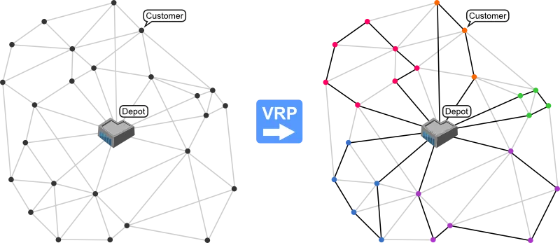

# route-optmizer
Routing vehicle application to find best routes to any store's orders. The application construct a solution with routes built from available store's orders. 

The most important endpoint is to **create routes solution**

The strategy used is called 'Push Forward'

The application is construed in node.js. So you need to have npm and node.js installed in your machine (latest versions are recommended).

To run and use the application:

1. clone the project to your machine --> https://github.com/gustavobertolino/route-optmizer.git

2. in the root repository of the project, run the command npm start.

3. call the endpoint you want following the instructions of each endpoint --> https://web.postman.co/collections/5181760-64bcb929-e600-4088-87b8-37250f8e7590?version=latest&workspace=1f994463-afca-40be-8942-0693c3464048

